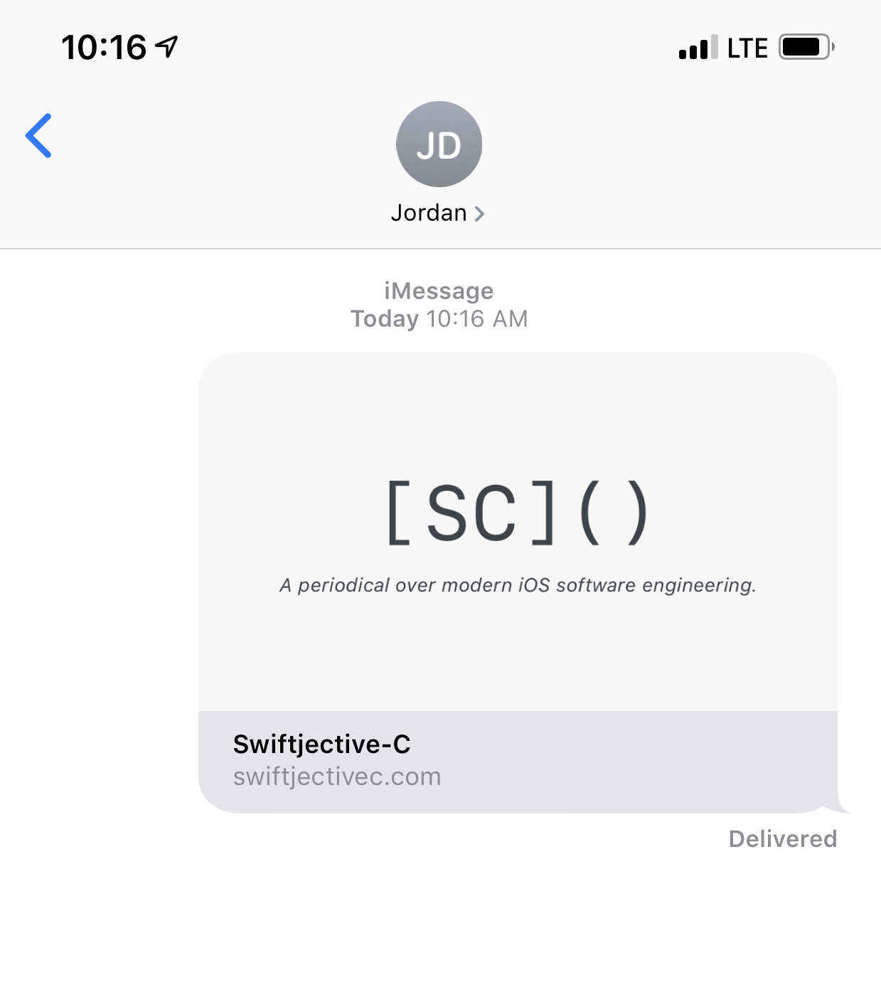
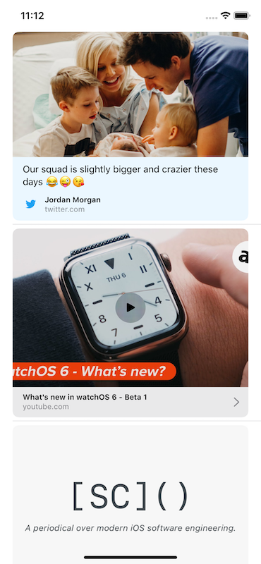

It wasn't but [three posts ago][1] that I began my piece by opining about the forgotten heroes of WWDC. 

Bring me your nascent frameworks, subtle API changes or things that were not graced with any keynote or State of the Union time. Those are the unknown territories I enjoy roaming, and the excitement of browsing them is amplified even more so by the fact that the documentation for them hasn't even landed yet during the beta period.

Today, we arrive at such a destination for showing links starting with iOS 13: the new LinkPresentation framework.

### Overview(framework: .linkPresentation)
The LinkPresentation framework has all the tools one might need to show rich, thumbnail previews of a URL. Though presentation is in its name, the brunt of its utility lies within its ability to retrieve meta data about URLs in a rather trivial fashion. 

The framework has actually been around for sometime now, as it appears in the runtime headers in the previous couple of iOS releases  - but now it's been handed over to us mere commoners as well.

Regardless, you're likely familiar with it as an end user of iOS already:


Firing over a link, or really any URL, within Messages shows it in action.

### Retrieving Metadata
One begins utilizing the framework by way of its [`LPLinkMetadataProvider`][1]{:target="_blank"}. At first glance, its ease of use is apparent by the lack of any sort of `LPMetadataProviderDelegate`, notification posting or similar feedback patterns. 

Instead, all you really need is one function:

```swift
let provider = LPMetadataProvider()
provider.startFetchingMetadata(for: theURL) { (metadata, error) in
    if let md = metadata {
        DispatchQueue.main.async {
            // Work with the metadata:
            // URL, title, icon, images, video and remote video URL data.
        }
    }
}
```

> As with most closure based APIs found within the Apple ecosystem, one must take care to dispatch back to the main queue if you plan to do any user interface processing.

The few lines of code above should suffice for most use cases, but there are some things to be aware of. The most important, however, is how the life cycle of these providers work, namely - they are one shot objects. 

Once they've kicked off their request, they are done. If you attempt to use it again, an exception is tossed immediately your way. Imagine if you were creating a `List`, or a `For Each`, of URL meta data in SwiftUI:

```swift
struct PostRow : UIViewRepresentable {
    var post:BlogPost
    let provider = LPMetadataProvider()
    
    func makeUIView(context: Context) -> LPLinkView {
        LPLinkView(url: post.postSlug)
    }
    
    func updateUIView(_ view: LPLinkView, context: Context) {
        provider.startFetchingMetadata(for: post.postSlug) { (metadata, error) in
            if let md = metadata {
                DispatchQueue.main.async {
                    view.metadata = md
                    view.sizeToFit()
                }
            }
        }
    }
}
```

That would crash as soon as scrolling and view recycling kicks in. Instead, get a new instance for each request. Mind the movement of the `provider` property into `updateUIView`:

```swift
struct PostRow : UIViewRepresentable {
    var post:BlogPost
    
    func makeUIView(context: Context) -> LPLinkView {
        LPLinkView(url: post.postSlug)
    }
    
    func updateUIView(_ view: LPLinkView, context: Context) {
        // New instance for each update
        let provider = LPMetadataProvider()
        provider.startFetchingMetadata(for: post.postSlug) { (metadata, error) in
            if let md = metadata {
                DispatchQueue.main.async {
                    view.metadata = md
                    view.sizeToFit()
                }
            }
        }
    }
}
```
The same idea applies to collection or table views. Beyond that primary consideration, providers can also set a timeout (which defaults to a reasonable 30 seconds) or cancel the request outright. The error value, if present, is also derived from `LPError`:

- .unknown
- .metadataFetchFailed
- .metadataFetchCancelled
- .metadataFetchTimedOut

Assuming the `com.apple.security.network.client` entitlement is setup, the provider object is ready to work and it'll fetch details on remote URLs without much to think about implementation wise. Though, you can stay local just the same. `LPMetadataProvider` can operate on your own app's URLs, in which case the (also new) [quicklook thumbnailing API][2]{:target="_blank"} will be used to present it.

### Presenting Link Previews
Of course, data is often only as useful to users as the views they are presented within. To that end, LinkPresentation offers a pre-baked solution which you may have noticed in the code above; `LPLinkView`.

A link view will base its visual representation of the link off of the information that was acquired by its meta data. A simple assignment within a meta data provider's closure in `startFetchingMetadata(for:)` will be a common pattern:

```swift
let linkView = LPLinkView(url: post.postSlug)
let provider = LPMetadataProvider()
provider.startFetchingMetadata(for: post.postSlug) { (metadata, error) in
    if let md = metadata {
        DispatchQueue.main.async {
            linkView.metadata = md
        }
    }
}
```

Results would look something along these lines:


Since link views can be sorted any which way in an interface, it has some smarts to size itself accordingly. It has its own intrinsic size set - but as we've done in the code samples, invoking `sizeToFit()` can aid in getting its constraints in a sensible state for automatic cell sizing scenarios.

Fortunately, this class is much more than static view. Depending on the meta data associated with it, you can expect inline video playback for Youtube content, maps for Apple Maps and all the images included in a Tweet as you see above.

### Efficiency Considerations
If you anticipate hitting the same URL again, you'll be happy to see that `LPMetaData` conforms to [`NSSecureCoding`][3] right out of the box. Since meta data providers have a limited lifespan by design, caching makes a lot of sense here from both an API design and user experience perspective. Skipping network calls for the same URL within a close time period is always a good idea.

```swift
if let data = try? NSKeyedArchiver.archivedData(withRootObject: retrievedMetadata, requiringSecureCoding: true) {
    do {
        try data.write(to: fileURL)
    } catch {
        // Dragons
    }
}

// Then later pull it back out if the request is for a cached URL
```

Further, a common flow for URLs is to pop them over to the share sheet via `UIActivityViewController`. Passing only the URL still works - just not as well. Now, if you're already conforming to `UIActivityItemSource` to pass off data, just implement the new `activityViewControllerLinkMetadata(_) -> LPLinkMetaData` function to return the link's content that you've already retrieved:

```swift
func activityViewControllerLinkMetadata(_ activityViewController: UIActivityViewController) -> LPLinkMetadata? {
    self.metadata
}
```
This route ensures the share sheet will show the link's data instantly, instead of asynchronously pulling it in via another meta data request. Plus, it's a gift that keeps on giving. If the users goes straight to Messages for the share request, the data is handed right off once more.

> Also, if you've got local data already, it's completely fine to create your own meta data object and fill in its contents yourself. There's nothing that says this meta data has to come from the network.

### Final Thoughts
Sometimes you need to roll your own solution to get a job done in software engineering. UIKit, or whatever the framework is, could have the pieces you need but might lack the holistic vision of what you're after. This was the case with link previews. If you've rolled your own, well - today's innovation is now tomorrow's deprecation. But this time, it's for all of the right reasons.

Let Apple take another menial task off of your plate. In the same spirit of SwiftUI's announcement, the more we can afford to Cupertino and Friends©, then the more we can spend time on making our own app's shine. Now, we check making link previews off of our own list.

Until next time ✌️.

[1]: https://developer.apple.com/documentation/linkpresentation/lpmetadataprovider
[2]: https://developer.apple.com/documentation/quicklookthumbnailing
[3]: {{ site.url | append:"/NSSecureCoding" }}

