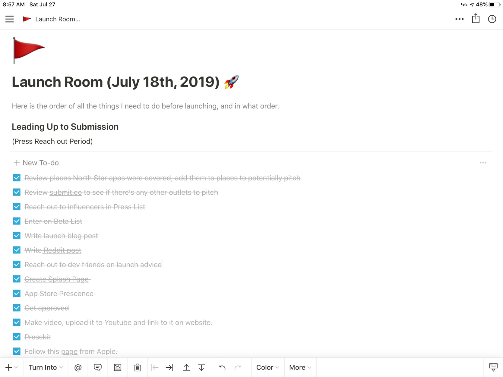
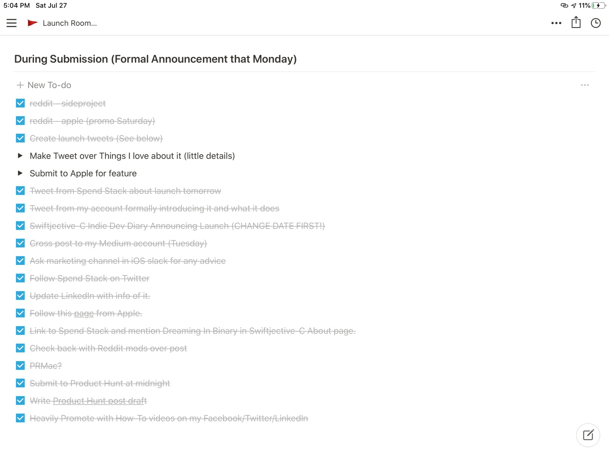
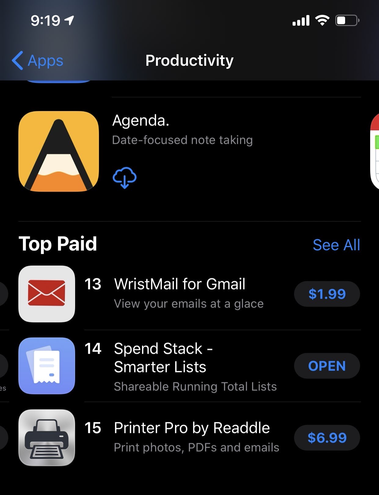

Y.O.L.O.

No, not the chant of today’s youth, declaring our ephemeral state of life wherein we should explore any dangerous activity our heart leads us towards. What I’m referring to is something much more sacred:

You only launch once.

And launch [Spend Stack](https://www.spendstack.com){:target="_blank"} I did, last Thursday in fact. Therapy for me as much as it might be helpful for you - I’d love to leave a brain dump of how I went about things, in no particular order and commingled together.

### North Star Apps
I’ve always found the concept of a North Star incredibly helpful. You have a goal, you’ve got others to look towards who’ve achieved that goal - and all of that gives you clarity on future decisions.

So, what were my North Star apps? After deciding early on I’d love to do a paid up front model, I looked at the developers who do that best:

- [Dark Sky](https://www.darksky.net/app)
- [Things 3](https://www.culturedcode.com)
- [Notability](https://www.gingerlabs.com)
- [iA Writer](https://www.ia.net/writer)

These apps are highly respected, are always charting and offer a premium experience with an up front buy in. These are the apps I want to be alongside of, and while it’ll take a lot of work to get there, it’s served me well to study others who’ve been doing the App Store dance extremely well.

These all leverage best in class features of their respective platforms, lean into premium experiences while being cogent about it and they do a fantastic job of instilling user confidence. All of those things speak to me, and it’s a direction I’m passionate in taking Spend Stack.

They are also all paid up front apps, the model I chose. Speaking of...

### Paid Up Front
Your pricing models dictates a lot of other choices you’ll make, so this was a decision I made very early on. 

As a one man show, I’m happy with far less users who are happy with the app than several orders of magnitude more who I’ve got to convert either via I.A.P.’s or a subscription. I prefer to offer you up the whole deal, no gated content or up selling required. 

A lot of people said this was a huge mistake business wise, and I can certainly see why they did. Paid up front apps are becoming a thing of the past, it has the most friction for acquisition and a lot of people simply aren’t willing to pay for apps. But, it’s still my favorite way to do business in the App Store. 

It does mean you have a tremendous responsibility though. If someone pays for your app, you absolutely have to deliver. That’s why I talk about the notion of being a best in class app so much, because if you are paid up front - you have to be one _and_ you are expected to be one. For me, that’s motivating.

Your user base is typically more involved too. People who pay money for an app are invested in them, and I don’t see this point brought up nearly enough as a major positive for paid up front business models. I’ve had several great conversations with a lot of them already, and we’ve even got a Reddit community going now to discuss the future of the app. 

From a support standpoint, being paid up front was critical to my initial launch success too. I replied back to each email timely, and that was a great experience all the way around. But, I was getting around 10-15 a day at about 500 downloads. Let’s say free apps yield about 10x more downloads, putting us hypothetically at 5,000 downloads if I had gone that route. I simply would’ve been drowning in email, and only a fraction of those users might be paying ones.

### Launch Checklist
Once I had a business model and an app mostly built, I started in on what a launch might look like.

I’m a Type A personality if there ever was one. I got lists on lists. And those lists are categorized by date and color coded. As such, my launch strategy was rigid and calculated. Anytime I had a thought about launching, it went through this flow:

- Get it into Reminders straight away
- Add any relevant notes to it, such as links.
- Later that night, vet all of these thoughts. If they were something I wanted to actually explore, I’d pop them into a Notion doc.

The aforementioned Notion doc was divided into three columns: Pre launch, launch day and post launch.

The things I had noted in the Launch and Post Launch sections are nothing unheard of - experiment and try new things, give search ads a spin, etc. It had notes on how to take time to craft some quality posts on the places you know of already; Product Hunt, some subreddits and similar places. 

The key to each of these places is to ensure you follow the rules to the letter, plus - you know spam when you see it. Nobody wants to read it. Even if it’s a highly trafficked spot on the web, if Spend Stack didn’t seem like the right subject matter for it, I skipped it. You want things to go great at launch - but how you do it also matters in my opinion.

### Your App’s Story
One of the most useful forms of spreading the word about Spend Stack was the one that was the most genuine, less market-y thing I did. Just simply telling the [app’s story]({{ site.url | append:"/introducing-spend-stack" }}). I wrote about the what and why of Spend Stack, and several people outside of our normal Twitter tech circle picked it up and resonated with it.

I said it before and I’ll say it again - tell your app’s story! It’s a great thing to do, and everybody wins: They get to know you, form a connection behind why it exists and then they also can see the app’s value proposition first hand.

If you go back and skim my post over Spend Stack’s story you’ll see it follows this exact format:

- Here’s a problem I wanted to solve
- Here’s the app I made that solves it
- Here’s the story about how I got the idea and how it came together

Simply put, as an indie you’re missing out if you’re not doing this. I really believe that. 

Think about each W.W.D.C. from the past few years, what does the keynote end with? It ends with a touching video showcasing the story behind their products, often showing developers talking about their struggles, triumphs and their family talking about the same thing. They do it because it resonates with us - it’s like looking in the mirror. 

You never know who’s going to really take to your story and identify with it. Those are great customers you’ll be able to make really happy.

### The Preoder Thing
After announcing it, preordering just kind of happened. My timeline was setup to where if app review went fine (and it did, it was approved on the first go around) I would have two weeks until launch. 

I told press about it on a Monday, and then one week later I publicly announced it on Twitter. Since I was already approved, I just put it up for preorder and didn’t really think much of it.

In hindsight - maybe that was super helpful for charting? I had about 80ish preorders, and while I’m not 100% this is way it works - I assume I started my launch day with those sales right off the bat. If so, that would’ve put me in a great place to start charting immediately.

From there, the rest of the ~130 sales from launch day came and I guess that’s what gave me the push to end up at #14 under Productivity within the United States:

### The Press
A launch can live and die by the press. Yet, I was thankful to chart in the top 15 for Productivity for three days without hardly any of it. And, that’s not bragging - that’s regret coming through.

Because if I _had_ gotten press, surely I could’ve pumped that number up much higher. I’ve got some early data to back this up, too. On recent talks with users, I simply asked “How did you hear about Spend Stack?” And every single one, *every single one*, has said it was from a blog or website.

The press can lift you up, plain and simple. Getting it, though - is hard. That’s another post in of itself, but the biggest mistake I made was reaching out far too late. I’ll touch on that more down below.

In any event, the press I did get was super helpful. [9 to 5 Mac](https://9to5mac.com/2019/07/18/spend-stack-list-app-budgeting-ios/) picked it up, so did [AppAdvice](https://appadvice.com/post/spend-stack-helps-you-keep-an-accurate-running-total-with-smart-lists/1329068268/1114042886) and [Club MacStories](https://club.macstories.net) included it in their newsletter and some other publications whose primary audience is outside of the U.S. did too.

I’ll always wonder if the press release I put out was part of that, but that’s kind of an opaque thing and hard to gauge. After all, you can’t manage what you can’t measure. 

Going forward, I’m taking the time to form friendships with the press so I can provide stories and news to them that provide value to their blogs/sites/etc. That’s the best outcome for each party involved.

### Ask the Experts
I’m a huge believer in asking for advice from people who are a lot smarter than you. Going by that metric for me, that’s a ton of people.

Cold emails are hard to pull off, but they can work. But you have to know _why_ they work. They work because you are genuinely reaching out to someone because you respect their domain knowledge, and you want to learn from them. They work because you are asking a pointed, specific question.

I don’t want to toss out specific names since I didn’t ask if it was fine to include them in this post, but there were some people I really respect with a lot of influence who took the time to answer questions I had. It made a huge difference in terms of just straight up encouragement (app looks great!), to lessons learned (I wouldn’t do X or Y) to general advice (I had no luck with marketing this way, but did that way).

### D.I.Y.
My launch was the antithesis of the lean startup methods. While there can be enourmous value in that approach, I think it’s fine as indies to go entirely the other direction. That is, if you want something done right(ish), do it yourself.

And, I did a lot of things myself 😅:

- The splash page
- The promo video
- The music for the promo video (I made it in GarageBand)
- Design, UI/UX
- Writing the press release
- ...basically all of it

There are some services I checked into that package these things up, but each one had a trade off or got me 75% of the way there. Rolling up my sleeves and doing it on my own dime took longer, but it also saved me money and ensured I came away with something I was proud of.

To make this shorter, the only thing I did _not_ do myself was the app’s icon. It’s a know your strengths thing, and everything I was doing just wasn’t working. The icon is your poster child for an app, I really believe it’s money well spent to invest in it to make sure it’s done right.

If I did it again, there is one other area I would outsource to someone I trust - my App Store screenshots. Right now, holistically speaking of Spend Stack, I’d wager that’s the weakest part of the package. It’s something I’m going to start improving right away.

> For example, Spend Stack is internationalized to work with all currencies. But, you wouldn’t know it from my screenshots. Plus, there’s too much text.

### The Mistakes
Let’s chat about where I left something on the table, so to speak. The biggest mistake? Without a doubt, it was my handling of the press. 

I reached out to them _entirely_ too late in the process (about 8 days before launch). While some did pick it up (mentioned above), overall I didn’t give them enough time to dive into the app and form an opinion of it. If you’ve got a beta, let them know today.

Take [Flighty](https://www.flightyapp.com), which launched a day or two after I did. Some of the press that covered it mentioned that they had been using it for months. And, that’s what it takes to truly know an app.

These writers are smart people. They need to get their hands dirty on an app to really know how they feel about it, let alone write a review of it. They are insanely busy too, with people like us all vying for their attention. It was simply  unrealistic to think anyone could’ve gone deep into Spend Stack in the timeline I provided.

Next up, I launched too cheap. If anything - I would’ve launched at a higher price point. You get an iPad and iPhone app for $5, and as developers we all know it’s worth more than that. We’ve got to remember, though, it’s not us we have to convince and convey value to, it’s the consumer.

The perception is already there that this should be a premium app if I’m asking you to pay me for it up front, and I don’t think developers should be afraid at all to lean into that. Especially indies. When I hit macOS, I don’t see any scenario where I would ship for less than $20.

You see Things 3 doing this to perfection. As of today, their iPhone app sits at $10 and their iPad app is $20. They can do that because they’ve built up relationships and goodwill with their users. I can’t ship like that, this is just the beginning for Spend Stack, but again - that’s my North Star.

### The Night Before Launch
One thing that was a huge mental load off, and time saver, was to get everything for launch day all prepped the day before.

So, on Wednesday night I had my launch tweet ready, my Product Hunt post was all created, every asset was ready to share and anything else I had to tend to was good to go. I just had to wake up and hit tweet, post or whatever else the verb was. 

It made for a relatively calm morning, where I could just sit back and take it all in. My wife made a lovely card waiting for me when I woke up, and instead of running around trying to get everything out the door - I could sit back, drink my morning quad shot (YAY BUDDY! COFFFFAY 🤘) and just read it.

### Lastly, Random Thoughts
Here are some things that were on my mind, but I didn’t know where to put them. So, herein I write a random list:

- *Be genuine.* Not only because it’s a better way to sell an app, but because it’s the right thing to do. Spend Stack won’t be right for everyone and I shouldn’t try to pretend that it is. If I post about Spend Stack on an online community, I don’t make it an advert for Spend Stack. I want to talk about it, and then see how I can relate my experiences to other people there to try and help them with the challenges they are facing.
- *Think about them.* If someone takes the time to type out a detailed bug report and it’s already on your radar, don’t just send back “Thanks, I know!” - take the time to let them know how much you appreciate it. And when it comes to the press, consider why they would even cover your app - what’s in it for them? Same for product choices, and really - anything else.
- *Make friends, not fans.* If you’re reading this, you’re likely an indie developer or are at least interested in iOS. I don’t ever want you to be my fan, I would much rather you be my friend. If someone bought your app and tweeted about it solely because they wanted to be nice and help, be sure to let them know you’ll do the same, and mean it. There can be a lot of ego in today’s social media driven society, but I truly believe that if you are just a nice person, people will naturally gravitate towards you, what you do and will listen to what you’re saying. 

> For more on that last point, I highly recommend reading the classic tome on the matter, [How to Win Friends and Influence People](https://www.amazon.com/How-Win-Friends-Influence-People/dp/0671027034) by Dale Carnegie.

To close things out, if I had to write a one sentence thesis on launching specifically for indies, it would go something like this:

Make a fantastic, best in class app and tell its story.

### Final Thoughts
Launching an app is a crazy, unnerving experience. You just really don’t know what’s going to happen. Especially if you are a solo indie, your time, resources and mental capacity are stretched thin. You’ve got to be persistent, insistent and persistent about your app’s success.

Though there’s certainly an art to launching, I’ve yet to crack its code. Glean what you can from what worked for me, but more importantly - take note of what *didn’t* work. Avoid those. Most importantly, if you’re launching soon, best of luck!

Until next time ✌️
